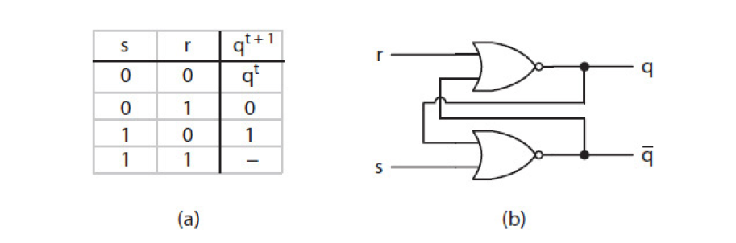
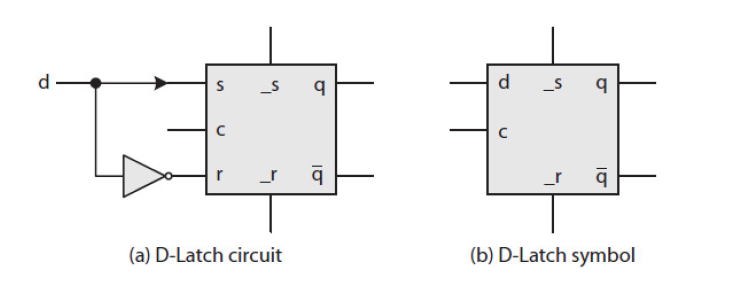

# Chapter 4: Sequential Circuits

### SR Latch

### D-Latch

### Disadvantages

Cannot depend on each other latches that use the same clock signal **signal chasing** will prevent circuit from working correctly. (section 4.4)
