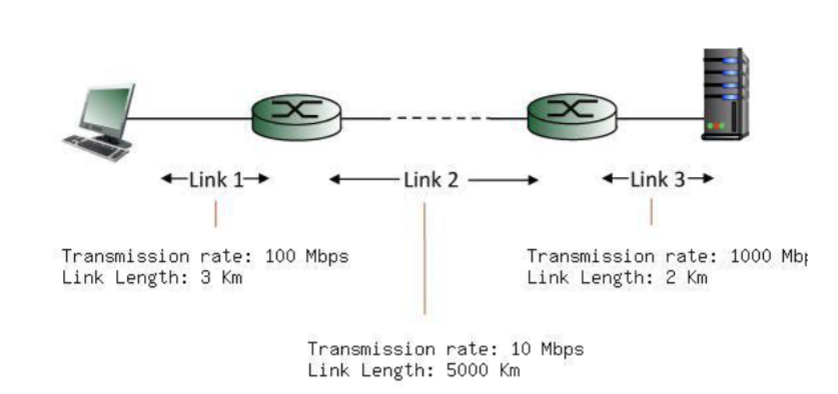

#### 1. Consider a Packet Switching Architecture

##### a. List and briefly describe the four components of delay
- **Nodal Processing Delay**: This is the time required to examine the packet header to determine where to send the packet and check for bit errors in the packet.
- **Queuing Delay**: The delay that the packet experiences while it is waiting to be transmitted. The delay will depend on the level of congestion that the packet switch is experiencing.
- **Transmission Delay**: Depends on the transmission rate of the link router $R$ and the length in  bits of the packet $L$. Transmission delay is $L/R$.
- **Propagation Delay** : The time it takes bits to travel across the wire at near light speeds.

##### b. Concisely describe the difference between transmission and propagation delay.
Transmission delay is only the time that it takes the link router to push the packet, and it is based on the length of the packet and the transmission rate of the link router. Propagation delay is based on the distance that the packet needs to travel.

##### c. How would the propagation delay be affected if the length of the packet is increased?
The propagation delay would NOT be affected by the length of the packet, so increasing it would have no effect.

#### 2. Suppose we have an application that transmits data continously at a steady rate (e.g.,   N-bits are sent every T time units, where T is small and fixed) for a long time.

##### a. Which network type would be more appropriate for this application: Circuit-switched or packet-switched? Justify your answer.
A circuit switched network would be more appropriate for this application because it is transmiting at a steady rate for a long time and a dedicated (reserved) link would give the best connection. This will guarantee that no packets have to worry about other network congestion affecting the transmission of the data.

##### b. Now consider a circuit switched network has a 150 Mbps link capacity where each user requires a bandwidth of 10 Mbps when transmitting, but are only active 10% of the time. What is the maximum number of users that can be supported? Justify the Answer.
In a circuit switched network that has a 150 Mbps linkl capacity and each user requires 10 Mbps, then the max number of users will be 150/10 = 15 max users. That is becuase the capacity is reserved and if the user is idle then the capacity is wasted. If we know that users are only active for 10% of the time, then it would be better to use packet-switching.

#### 3. Consider a packet-switched network that has a 150 Mbps link capacity where each user requires a bandwidth of 10 Mbps when transmitting but are only active 10 percent of the time. Also, assume that there are 29 packet switching users.

##### a. Calculate the probability that exactly one user (i.e., any one of the 29 users) is transmitting at a given time, while the remaining are not. Using binomial distribution, show the formula for the calculation and the final result to 6 decimal places. Note that it may be easier to write a program to find the final value.

##### b. Now, calculate the summative probability that any up to 15 of the 29 users (i.e., 0, 1, 2, 3, ..., 14, or 15 users) are transmitting at the same time, while the remaining users are not. Using binomial distribution, show the formula for the calculation and the final result to 6 decimal places. Note that it may be easier to write a program to find the final value.

##### c. What is the probability to 6 decimal places that more than 15 of the 29 users are transmitting at the same time? What does this mean about the number of users supported under packet switching versus circuit switching for this scenario?

#### 4 Consider the following network

**You may assume a packet length of 8000 bits and ignore** 
##### a. 
