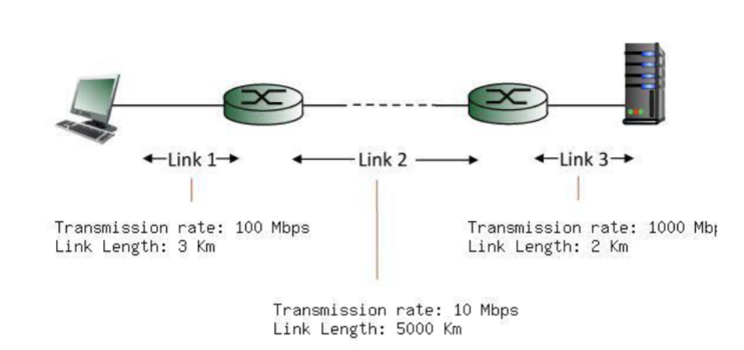

#### 1. Consider a Packet Switching Architecture

##### a. List and briefly describe the four components of delay
##### b. Concisely describe the difference between transmission and propagation delay.
##### c. How would the propagation delay be affected if the length of the packet is increased?

#### 2. Suppose we have an application that transmits data continously at a steady rate (e.g.,   N-bits are sent every T time units, where T is small and fixed) for a long time.

##### a. Which network type would be more appropriate for this application: Circuit-switched or packet-switched? Justify your answer.
##### b. Now consider a circuit switched network has a 150 Mbps link capacity where each user requires a bandwidth of 10 Mbps when transmitting, but are only active 10% of the time. What is the maximum number of users that can be supported? Justify the Answer.

#### 3. Consider a packet-switched network that has a 150 Mbps link capacity where each user requires a bandwidth of 10 Mbps when transmitting but are only active 10 percent of the time. Also, assume that there are 29 packet switching users.

##### a. Calculate the probability that exactly one user (i.e., any one of the 29 users) is transmitting at a given time, while the remaining are not. Using binomias distribution, show the formula for the calculation and the final result to 6 decimal places. Note that it may be easier to write a program to find the final value.

##### b. Now, calculate the summative probability that any up to 15 of the 29 users (i.e., 0, 1, 2, 3, ..., 14, or 15 users) are transmitting at the same time, while the remaining users are not. Using binomial distribution, show the formula for the calculation and the final result to 6 decimal places. Note that it may be easier to write a program to find the final value.

##### c. What is the probability to 6 decimal places that more than 15 of the 29 users are transmitting at the same time? What does this mean about the number of users supported under packet switching versus circuit switching for this scenario?

#### Consider the following network

**You may assume a packet length of 8000 bits and ignore ** 
##### a. 
