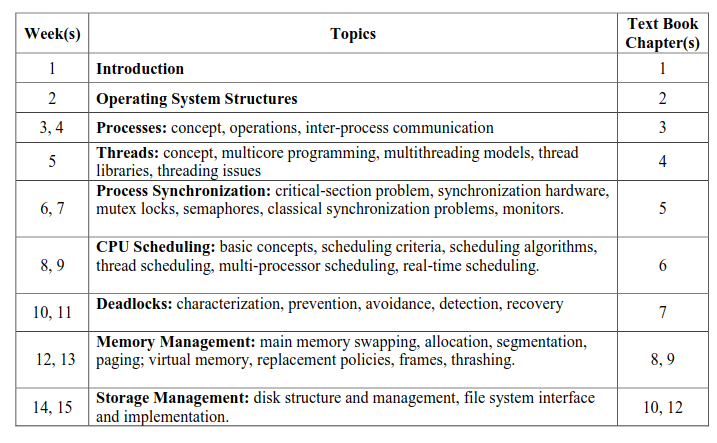

# Syllabus

## Instructor
Ghassan Shobaki

## Times and Location
Mon-Wed-Fr 8AM-8:50AM | ~~Riverside Hall 5020~~ Library 3021

## Course Playlist
[Youtube Playlist](https://www.youtube.com/playlist?list=PL6KMWPQP_DM-7tMNjUa7X2zGrc8jipPeI)

## Textbook 
Operating System Concepts (10th or 9th Edition)

## Important Dates
| Date            | Event           | Materials       |
| --------------- | --------------- | --------------- |
| Friday 2/16     | First Exam      | Weeks 1, 2, 3   |
| Friday 3/15     | Midterm         | Week 1-7        |
| Friday 4/19     | Second Exam     | Week 10, 11     |
| TBD             | Final Exam      | Week 1-15       |

## Grading Weights
> :warning:**IMPORTANT**  To pass theh course you **MUST** pass the exams with above 50%.  

| Item            | Weight          |
| --------------- | --------------- |
| Assignments     | 15%             |
| 2 Exams         | 10% each        |
| Midterm         | 25%             |
| Final Exam      | 40%             |

## Grading Rubric 
| Grade           | Percentage      | Definition of Grades |
| --------------- | --------------- | ---------------      |
| A+              | 95 (unofficial  |                      |
| A               | 90              | Exemplary            |
| A-              | 85              |                      |
| B+              | 75              |                      |
| B               | 70              | Deep understanding   |
| B-              | 65              |                      |
| C+              | 60              |                      |
| C               | 55              | Satisfactory         |
| C -             | 50              |                      |

## Course Outline

