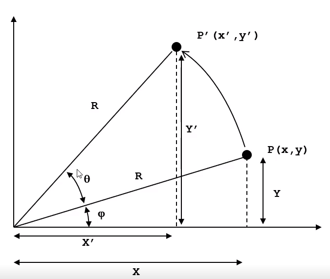
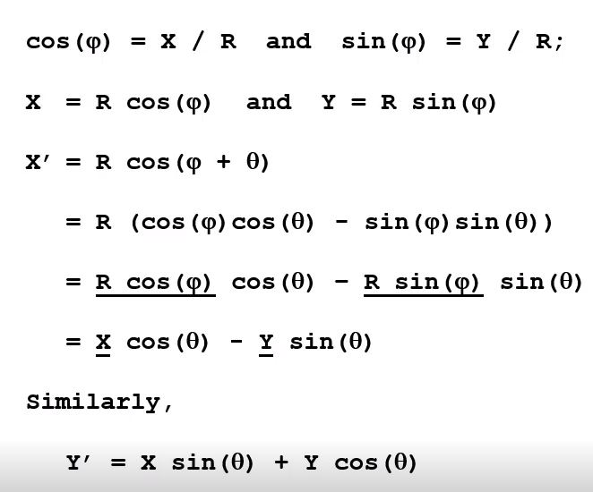
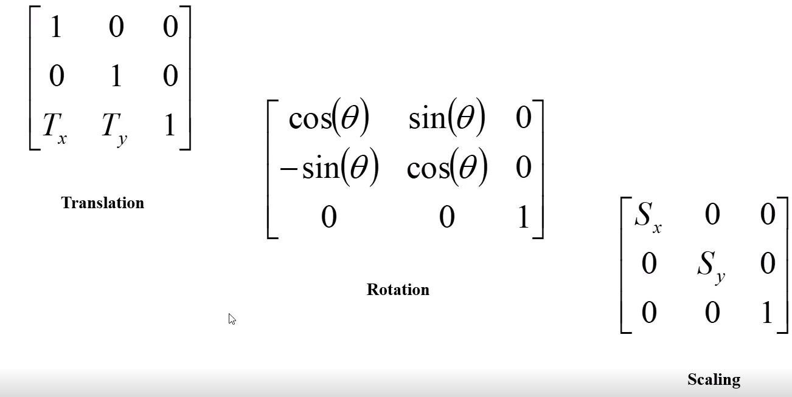
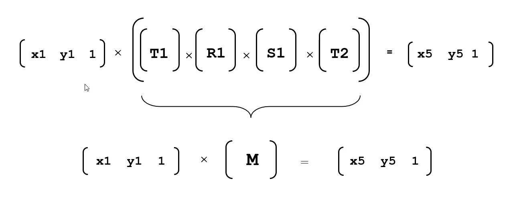

# CSC133 Matrix Multiplication

## Summary 
Basic refresher on point and line transformations without matrixes and then with matrixes. 

## Affine Transforms 
- Translate
- Rotate
- Scale

### Translate
Translation is just adding of vectors.

### Scaling 
Just multiply the values in the point to get the scaled point. Do this for all points in the object to get the scaled version of the object.

### Rotate around arbitrary point 

 

## Tranformation using Matrixes

### Homogeneous Coordinates
We represent points as tripples so that we can perform all the transformations using the same matrix and taking advantage of matrix multiplication's associativity. 

### Concatenation of Transforms
Since matrix multiplications are **associative** then you can simply multiply all the matrix transformations with eachother before you apply it to your vector. This results in computations savings because you can store the precomputed transformation matrix and then apply it to every point in the object instead of computing the transofmration for each point. 

