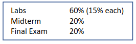
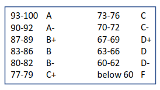
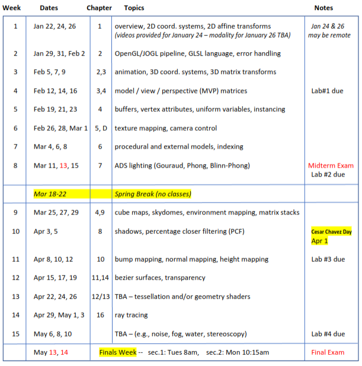

# Syllabus

## Times and Location
Section 2 | MWF 11 to 11:50am | Room: **RVR-5029** 

## Textbooks
- (Required) **Computer Graphics Programming in OpenGl with Java, 3rd Edition** 
- (Recommended) **OpenGL SuperBible (6th or 7th Edition)** 

## Course Description
Real-time rendering techniques for modern 3D computer graphics systems. Topics include mathematical foundations of
3D graphics such as parametric surface representation and 3D transformations, the synthetic camera paradigm, hidden
surface removal, managing 3D graphics data, building and using 3D models, 2D and 3D texture mapping, lighting and
materials, shadows, cube maps and skydomes, techniques for terrain generation, normal mapping, bump mapping, height
mapping, tessellation and geometry shaders, atmospheric effects such as fog and clouds, simulating water, compositing,
generating and applying 3D noise, 3D animation, ray tracing, anaglyph and side-by-side stereoscopy, and performance
issues such as controlling level of detail. Emphasis on hardware support and shader pipeline programming.

## Important Dates 

| DateTime        | Event                        |
| --------------- | ---------------              |
| Wed March 13    | Midterm Exam                 |
| March 18-22     | Spring Break - No Class      |
| Monday April 1  | Ceasar Chavez Day - No class |
| Monday May 13   | Final Exam (11:15am)         |

## Grading Weights 

## Grading Rubric

## Course Schedule 

