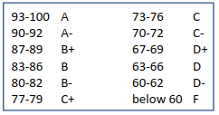
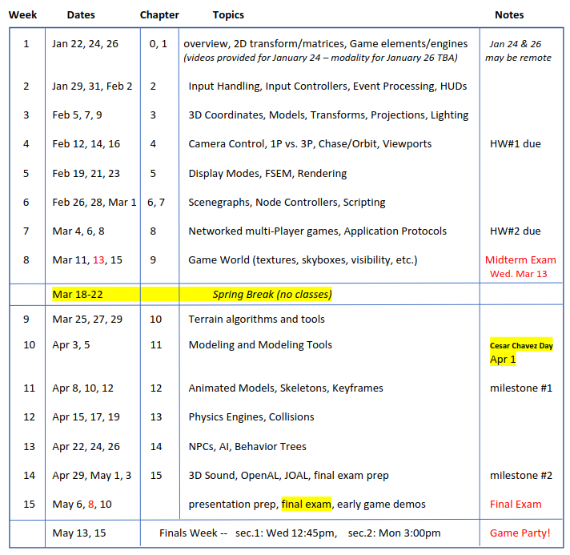

# syllabus

## Overview

Architecture and implementation of cmputer game systems. Topics include: game engine architecture; realtime interactive 3d graphics; input handling; screen and rendering management; lighting; camera control; modeling and model animation; scenegraph organization and processing; AI for non-player characters; physics engines; spatial sound; multi-player games and related networking protocols; texture mapping; scripting; skybox and terrain modeling.

The main objectives of the course are for students to learn about the architecture of modern computer video games and the game engines on which they are built. Along the way, students will also learn some of the fundementals of 3D graphics, and will build some game engine components and a simple 3D game of their own choosing using a simmple game engine.

For programming we will be using Java, TAGE, OpenGL, JOGL, JBullet, JInput, and JOAL.

## Important Dates

| Date            | Event                   |
| --------------- | ---------------         |
| Wed March 13    | Midterm Exam            |
| March 18-22     | Spring Break (no class) |
| Monday April 1  | No class                |
| Wed May 8       | Final Exams             |
| Wed May 15      | Game Demo 12:45-2:45pm  |

## Grading Weights 
| Type            | Weight          |
| --------------- | --------------- |
| Game Project    | 50%             |
| Midterm         | 10%             |
| Final Exam      | 20%             |
| Labs #1, #2     | 20%             |

## Grading Rubric 

## Course Schedule 

