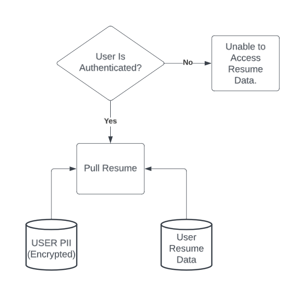

# CSC190 Project Proposal | Resume Manager

## Client Information
Cory Lemings | Department of Rehabilitation (DoR) | Cory.Lemings@dor.ca.gov | 707-576-2507

## Problem
The following is the project problem as explained by the client and interpreted by Jonathan Camarena.

### Client Description
People need a resume, but do not have the language to create one easily create one.

### Interpretation
There is a need for people that the client works with to create and manage resume information. Current solutions do not work due to complexity so the application should provide a user friendly way to create resumes.

## Requirements
These are the requirements as stated by the client and the csus project 190 requriements.

### Client Requirements

#### Technical Requirements
* Import Existing Resume and parse Job titles
* Use Parsed Job titles to create a list of tasks.
    > The next thing would be to create a word document with a list. Why specifically this? Is there some other artifact we can produce? Maybe a new resume?
* Must be workable.
    > What do we mean by workable here? Ease of use? or extensebility of the application?

#### Security Requirements
* Not store Personally Identifiable Information (PII).
    > what if we take special precautions? encryption, 2 factor authentication etc.

#### Cost Requirements
* Must be free to use.
* Low cost (hosting costs only if any)

### Project 190 Requirements
* Front end (GUI)
    - Met by frontend where users upload/create their resume.
* Database Backend
    > :information_source: Store Resumes (without PII) - see [this section](#storing-resume-data-without-pii)
    - Met by storing of user preferences
    - Met by storing of user resume (master)
    - Met by storing of 
* Login/Authentication
    > Client prefers not to store PII and authentication/Login is not a hard requirement
    - Met by login to store preferences.
    - Met by login to store resume master

<!-- ## Design -->
<!-- ### Storage -->
<!-- This section is to address storage concerns and suggest possible ways of handling PII.  -->
<!---->
<!-- #### **Why store Resume data?** -->
<!-- > This section is to explain why I think storing the resume data could improve user experience. -->
<!---->
<!-- For ease of use, we probably do not want the user to have to input all their information each time they want to redownload or edit their resume. See the following scenario:  -->
<!-- 1. User creates resume and downloads it. -->
<!-- 2. A while has passed and user has new experience to add to resume. -->
<!-- 3. User must re-input their past resume experience to create an updated resume. -->
<!-- 4. User has wasted some time that could have been avoided by saving resume. -->
<!---->
<!-- An alternate scenario where we store the resume data:  -->
<!-- 1. User creates resume and downloads it. -->
<!-- 2. A while passes and user has new experience to add to resume. -->
<!-- 3. User logs in, and is able to edit their resume with new information. -->
<!-- 4. User is happy and has saved time. -->
<!---->
<!-- **Pros of Storing the resume info?** -->
<!-- 1. **Convenience**: users are able to easily access their already created resumes and edit them. -->
<!-- 2. **Integrations**: easier to extend with other integrations down the line. For example -> Say you want to in the future allow employers to search a the database for qualified individuals -> Then storing these resumes would make this a possibility.  -->
<!---->
<!-- **What are the Cons of Storing this information?** -->
<!---->
<!-- 1. **Cost**:  information needs to be stored, and that will cost money. For information on potential costs I would refer you to AWS pricing model [[here](https://aws.amazon.com/rds/sqlserver/pricing/)] and look at the Database storage costs. On average it seems like it costs about  -->
<!-- 2. **Privacy**: Since some information in the resume will be personally identifiable (PII) [[glossary](#glosary)] -->
<!---->
<!-- **Conclusion**  -->
<!-- I think the convenience of being able to make edits and download the same resume multiple times greatly outweighs the negatives, specially when you consider security a first class objective of the project and deal with storing information in a responsible way. -->
<!---->
<!-- #### Storing Resume Data without PII -->
<!-- One possible to store Resume information without any PII is to keep resume data and PII separate. We do this by keeping two databases. One that is used only for storing user Encrypted PII data, and the other used to store Resume data, (experience, skills, education, etc). Only authenticated users would be able to pull their resume information.  -->
<!---->
<!-- ##### Example Diagram:  -->
<!--  -->
<!---->
<!-- ## Glosary -->
<!-- * **User**: The person using the application.  -->
<!-- * **PII**: Personally Identifiable Information [[see here for a formal definition](https://www.ibm.com/topics/pii#:~:text=Personally%20identifiable%20information%20(PII)%20is,full%20name%2C%20or%20email%20address.)]  -->
<!---->
<!---->
